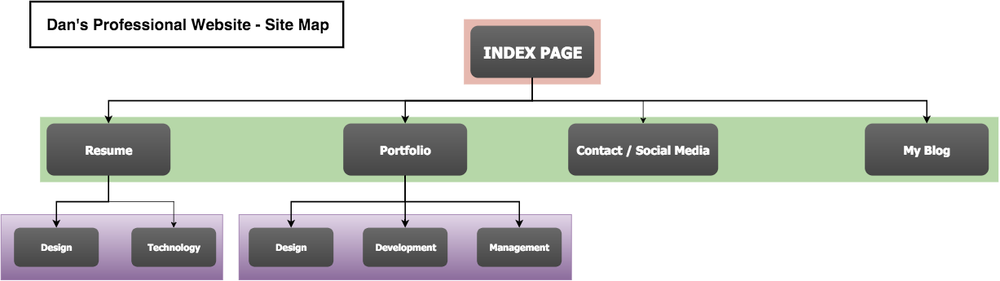

# 2.3 - Intro to Design and Site Planning Reflection

## What are the 6 Phases of Web Design?

1.  Information Gathering
2.  Planning
3.  Design
4.  Development
5.  Testing and Delivery
6.  Maintenance

## What is your site's primary goal or purpose? What kind of content will your site feature?

The Primary goal of my site is to share information about myself. In a sense, instead of selling a product, I'll be selling myself to potential employers. Aside from marketing myself, I'd like it to to be place where I can express myself through digital content.

The content on this site will include my resume, previous graphic design projects I've worked on, links to social media (linked in, facebook), a picture of myself, and a blog. Since this site will continue to grow and expand over time, the content will change quite a bit over time.

## What is your target audience's interests and how do you see your site addressing them?

My target audience is most likely someone that will be a possible business partner or an employer.  They will be interested in seeing my site because I may be hired to design and develop a site for or with them. In a sense, the site's usability and design is a piece of work in my portfolio. They will also be interesed in being able to quickly gather detail about my previous work history and they might want to read my blog to get a sense of not only **what** I can do, but **who** I am, as a person.

## What is the primary "action" the user should take when coming to your site? Do you want them to search for information, contact you, or see your portfolio? It's ok to have several actions at once, or different actions for different kinds of visitors.

I believe the primary action is going to have them see my resume. Once they see my resume and verify that they are interested in my credentials, I want them to be able to see my portfolio work. The above actions are mostly intended for employers. I would want potential business partners, family, friends, and other interested parties to be able to see my Social Network, see my photography work, and to be able to read and interact with my blog. I may want to consider breaking this websites into "professional" and "personal" sections.

## What are the main things someone should know about design and user experience?

When I studied User Centered Design at Depaul University, the golden rule was to remember that you, as the designer, **are not the user**. It is always hard to remember this.  In the article we read, they expressed that historically, websites were desiged with only the interest of you(the designer), and the client. This philosophy leaves out the user.

Modern usability considers the wants and needs of the user. How the user experiences a website has a lot to do with the the usability of the site. Usability refers to how easy it is to interace with a website or application. There are a few ways to determine this. One way is to create a few different prototypes, which can be a very "low fidelity" working draft of what a website will look and feel like. By introducing this prototype to multiple users and having them "rate" the experience, you, as the designer, can easily determine what elements of the design are easy to use and which ones are difficult. You may notice that certain types of people will strongly favor one part of the design and other types of people will dislike that same element.  For this reason, UX designers will try to create "personas" to separate the general types of users into groups. For instanace, the technical user could have a persona of "Techy Tina". The elderly non technical user could be "Traditional Tom".

##  What is user experience design and why is it valuable?

I beleive I covered what user experience is in the above paragraph so I will focus on "why it is valuable." I believe it is valuable because by knowing who the users are, and what they want, we can ensure that websites and/or applications will be tailored or our audience. When I pick up a suit, I want one that fits me well. If I only find sizes that fit marginally well, I will most likely not return to purchase suits from that store. One size fits all rarely applies for suits. Same goes for websites that are tailored to their users. We can expect a high rate of return from users that we design a website/application for.

## Which parts of the challenge did you find tedious?

Normally, I find that making a site map can be a bit boring and tedious. Since I've had to do quite a few of these now, I've learned a few applications that can make this process easier. For my site map, I used a web application called "draw.io". The image below was made in about 10 minutes using this web application.

