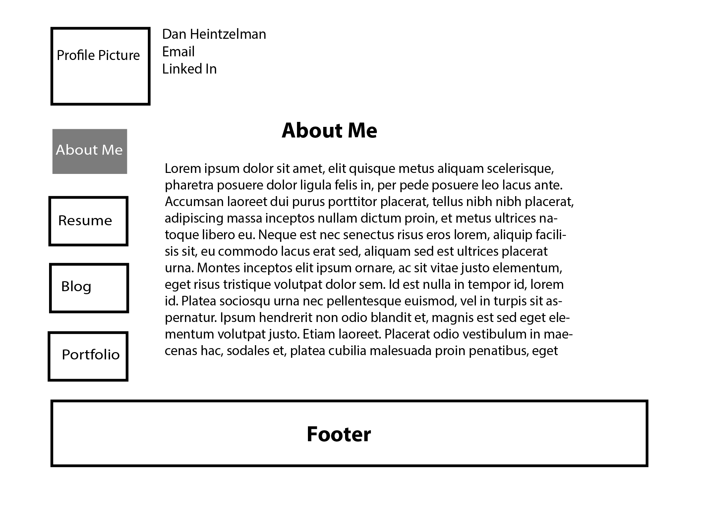
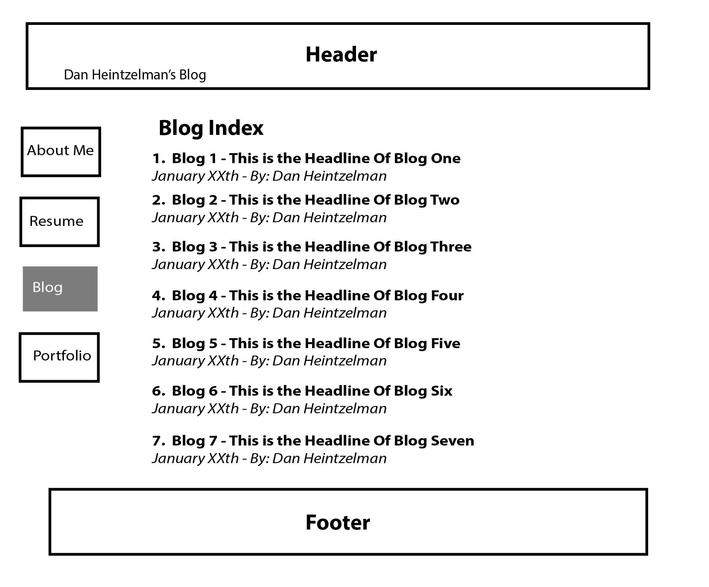

#2.4 Wireframing Reflection

##What is a wireframe?

A wireframe is quick conceptual view of the framework of a design for an application, website, or interace. The intent of a wireframe is that it is easy and quick to create so that multiple iterations of an interface can be made without spending too much time on it.

##What are the benefits of wireframing?

Most importantly, wireframes help you decide the structure of what you building without putting too much time or energy into producing high quality images. If I were to build a full rendered concept of website and then was told by a user/client/teacher that it needed to be re-designed, I would have wasted too much time. A wireframe can allow you to move on to design/coding phase with confidence that your layout has been well thought out.

##Did you enjoy wireframing your site?

For this excerise, I decided to use Adobe Illustrator to wireframe my site. In previous exercises I have used web based applications such as Balsamiq and/or moqups.com. I actually did not find the process as enjoyable as I had hoped. I almost think that I would be more successfull with a quick sketch before bringing into illustrator. However, I have also found that newer wireframing tools like balsamiq are quite intuitive and I may end up going that route in the future.

##Did you revise your wireframe or stick with your first idea?

I revised my wireframe a few times until I was satisfied with the layout. I started grouping items together in Adobe Illustrator because it was becoming tedious to move them around.

##What questions did you ask during this challenge? What resources did you find to help you answer them?

During this challenge, I researched on how to use Adobe Illustrator to create a wireframe. I found a few articles that gave tips on how to layer wireframes. One layer can be used for the actual wireframe, one layer can be used for arrows that explain the actions of each button, and another layer can be used for labels. However, since I was trying to timebox and make a low fidelity wireframe, I didn't spent too much time with layers for this activity.

##Which parts of the challenge did you enjoy and which parts did you find tedious?

I enjoyed doing the research and looking at all of tools out there that can be used for wireframing. However, I decided that the tool that I chose, Illustrator, can be tedious. I honestly felt the whole process went slower than I would have liked. In the future, I think I could benefit from using Illustrator if I create or use existing templates first.

##Wireframe Index

##Wireframe Blog Index

