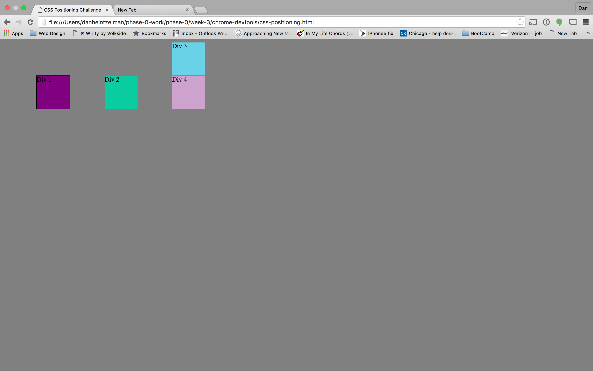

# 3.4  Chrome Dev Tools

## Images for Challenge

**Change Color**

**Column**

**Row**

**Make Equidistant**

**Squares**

**Footer**

**Header**

**Sidebar**

**Get Creative**

## Reflection Q/A

1.How can you use Chrome's DevTools inspector to help you format or position elements?

The inspector tool in Chrome is great way to both analyze an existing webpage and to help create a new one.  If I want to "emulate" a style being used on another page, I typically will pull up the inspector so I can see the highlighted "box model" of an element.  This makes it very easy to distinguish margin from padding, and padding from content.

When I create a new website, sometimes I don't know if a line of CSS code actually is affecting the element. To check, I use the inspector to see if my change actually took place. For instance, if I give a padding-left: 5px , and the padding is still 0, I know that some other line of code or inhereted property value took precedence.

2.How can you resize elements on the DOM using CSS?

There are a number of ways to resize elements on the DOM (Document Object Model) using CSS. I typically will use the height and width properties to establish size of an element.

3.What are the differences between absolute, fixed, static, and relative positioning? Which did you find easiest to use? Which was most difficult?

First, I want to mention that I think these concepts are a little difficult to describe. I was inspired by this css-tricks article, [Absolute, Relative, Fixed Positioning: How Do They Differ?](https://css-tricks.com/absolute-relative-fixed-positioining-how-do-they-differ/)

**Absolute**

Absolute positioning will position an element absolutely relative to the next parent element that is also a positioned elmenent (non static). So, if I have a div inside of a header, and I give the div a position of absolute and set it 20px from top, it will be 20px down from the inside top of the header, ONLY if the header is a "positioned" element. Setting the header to position:relative would be enough to make it a "positioned" element. However, if there are no parent elements that are positioned, then the div would be 20px down from the html, or the page itself. **NOTE**, if the header is fixed to the top of the page already, you may not even notice the difference.

**Relative**

Relative positioning in itself doesnt really mean anything. It just means the element will be positioned where it normally would be, however it allows the element to be moved from its current position using "positioning properties". Now, we can say add left:20px to move it 20 pixels to the left from where it normally would be in the flow. Also, we can use position:relative to make sure that child elements with positioning of absolute, flow in relationship to it.

**Fixed**

This is like absolute, however, this will position and element in relationship to whatever the current brower position is. In web lingo, we call this the "viewport". Whenever you see elements on a web page that follow you as you scroll down the page, this is because these elements are fixed to your "view" or "viewport".

**Static**

Well, if you don't give an element any position:value , then it will be static by default. This just means the element will flow as it normally would on the page. You wouldn't ever specify static in a property/value pair unless you were trying to force it out of relative, absolute, or any other positioned state.

4.What are the differences between margin, border, and padding?

**Margin**

Simply put, margin is the invisible space between elements. Margins can be on the top, bottom, left, or right. When you see big space between H1's, this is because the browsers default "user-agent" (basically the default built in css) has large margins between Headers.

**Border**

This is the last boundary that can be physically seen before the invisible margin area. This is quite literally the border of any element and is just outside of the padding in the box model.

**Padding**

Padding is what defines the space or "buffer" between the content (such as text), and the border. When you define a background-color, it is coloring both the content background and the padding. Think of this as the area in a painting between the image itself and the frame.

5.What was your impression of this challenge overall? (love, hate, and why?)

I thought this challenge was a **fantastic** way of illuminating the differences between display types, positioning types, and element dimensions. Even though I have some CSS knowledge, I think positiong concepts can be very tricky to understand, and only through these types of exercises can we understand how they work.

