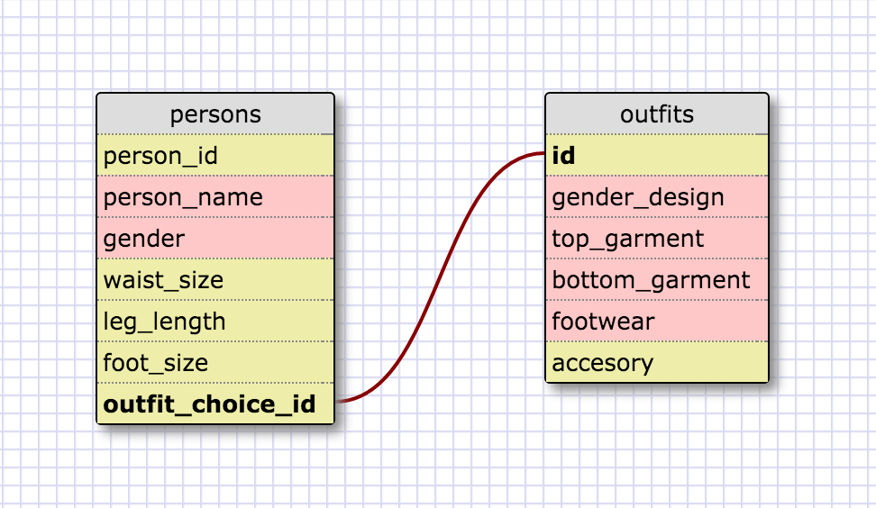

#8.4 - Intro to Database Schemas and SQL

##Release 5 - selecting from a database

1. select * FROM states;

2. select * FROM regions;

3. select state_name,population FROM states;

4.
```SQL
select state_name,population
FROM states
ORDER BY population DESC;
```

5.
```
select state_name
FROM states
WHERE region_id='7';
```
6.
```
select state_name,population_density
FROM states
WHERE population_density>50
ORDER BY population_density;
```
7.
```
select state_name
from states
where population between 1000000 and 1500000;
```
8.
```
select state_name,region_id
from states
order by region_id;
```
9.
```
select region_name
from regions
where region_name LIKE '%central%';
```
10.
```
SELECT regions.region_name, states.state_name
FROM regions
INNER JOIN states
ON regions.id=states.region_id;
```
##Release 6



##Release 7 - Reflection

**1.What are databases for?**

Databases are for storing large amounts of tabular data in a structure that is efficient to access. They are the backbone to almost any technology driven
industry. Facebook users, email users, amazon accounts, etc, etc are all
stored inside large databases and referenced millions of times a day to
allow users to be authenticated, information to be modified and updated,
etc.

**2.What is a one-to-many relationship?**

A one to many relationship is a cardinal relationship that expresses the
relationship between two tables. To use an example from one of the videos.
One person may have just 1 car, or they may have multiple cars. So 1 person
(singular), could have 4(multiple) different cars from the car table.
Therefore, this is a one-to-many relationship.

**3.What is a primary key? What is a foreign key? How can you determine which
is which?**

The primary key is an attribute value that remains unique among every instance
of the entity. For instance,in a list of people with SSNs, the SSNs could be
chosen as a primary key because there will never be two different people with
the same SSN. A foreign key would be taking the primary key of one table, and
adding it as a attribute on other table that you would want to relate to. In
our homework, region ID (on the states list) would be the foreign key because
the source of that value is actually on the regions list.

**4.How can you select information out of a SQL database? What are some general
guidelines for that?**

Information can be selected out of a database using the correct SQL syntax to
call values from a table or set of tables. Selecting the name column out of the
table people would look like this.

```
SELECT name
FROM tables;
```
SQL is not case sensative, so technically SELECT and FROM do not need to be in
caps, but it makes it easier to read. Also, you can type this command out on one
line, just as long as you finish the whole query with a semi colon. The multiple
line format is also just there for readability.
