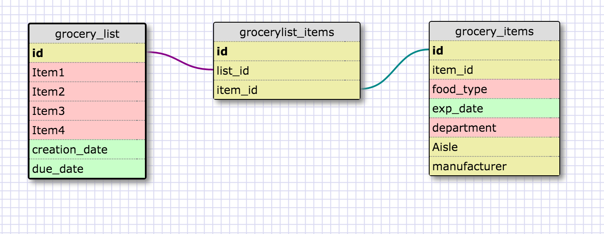

#8.5 More Schemas

##Release 2 - One to One Schema

In my example of a one to one schema, I am creating a car inventory database.
This could potentially be used at a dealership or a warehouse. The two Schemas
are linked by their one common attribute which is the VIN (Vehicle Identification
number). One reason one to one relationships are used is to make querying
more efficient. In the video I watched, the gentleman explains that in a loan,
there are many attributes which will rarely be accessed (loan details). For
this reason, the less queried items are moved to a separate table, linked by one
item, for performance. In my example, the first table (car_inventory) includes
the items that a customer might be most interested in, such as color, make, model
and price. The second table includes items that may be rarely queried, or maybe
rarely queried by customers, but only by back of house employees. So, if I was
developing the car dealer website, I only may need to access simple things about
the inventory. In fact, in my research I read that the primary table may be hosted
for instance online, and it may be linked to the details table which is stored
say, at the dealer or in a higher cost more secure server,
(where it is private and only needed to be accessed by a few people). This causes
less confusion when querying simple details about each car.

##Release 3

I realize now the directions did not tell me to make my own many to many schema,
but I did anyway!

##Release 4

##Release 6 - Reflect

**1.What is a one-to-one database?**

A one-to-one database is where both tables have one single relationship to
one another. Think of these items as a pair. Each country can only have one
capital city and each capital city is only attached to one city. Also, this
can be used to make an extension of one table to another. Both tables contain
information pertaining to the same item(such as a loan), but they have different
attributes describing that loan.

**2.When would you use a one-to-one database? (Think generally, not in terms of
the example you created).**

These can be used when there is mutually exclusive connection between two items.
However, in practice, this is most commonly used to separate one large table
of attributes into two tables. One table would contain the most commonly queried
attributes and the other would contain less commonly queried attributes.

**3.What is a many-to-many database?**

A many to many database is when two entities share many relationships between
them. So, 1 instance of an entity in table 1 would relate to many instances
of entities in table 2. Vice versa, 1 instance in table 2 would relate to many
instances in table 2.

**4.When would you use a many-to-many database? (Think generally, not in terms of
the example you created).**

A many to many database would be used when you need to join to tables that contain
to many relationships to connect them through 1 common relationship. In this case,
you need a separate join table to link them together.

**5.What is confusing about database schemas? What makes sense?**

I think it is difficult to separate attributes from attribute values. Like in
the grocery list challenge, would bread be an attribute of grocery items, and then
wheat/white/rye/etc would be their values. I realized that each entity of grocery
item would be different so there would be a value bread, with a value wheat, etc.
It can get confusing to conceptualize this.
